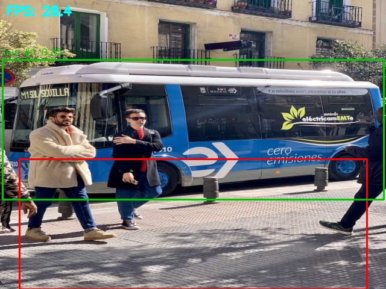
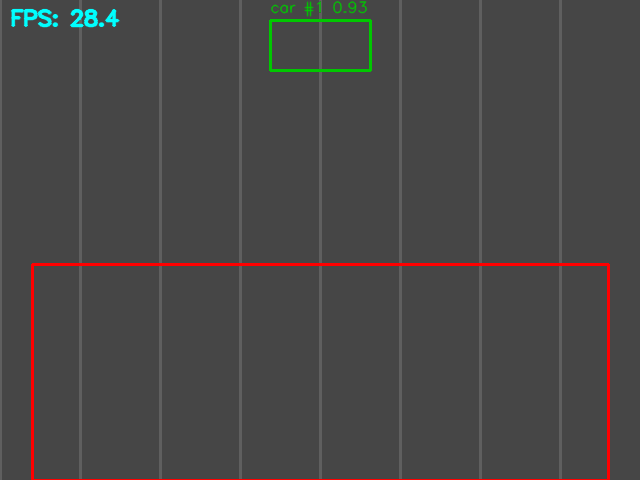

# Edge Traffic Vision — Real-Time Vehicle Detection & Violation Monitoring


> A real-time vehicle detection and restricted-zone violation monitor designed to run on constrained edge hardware (Raspberry Pi class devices), with zero cloud dependency.



*Real YOLOv8 (`yolov8n`) detection running through this pipeline's resize + overlay code on a standard Ultralytics test image — green box is the detection, red outline is the restricted zone (no violation here since the bus's centroid is outside it).*



*Synthetic demo (`demo/generate_demo_gif.py`) exercising the speed-monitor, zone-monitor, and overlay code directly — shows a simulated vehicle triggering both a speeding and a zone-intrusion alert.*

---

## What It Does

A camera feed (webcam, video file, or Pi camera) is captured and downscaled, then run through YOLOv8 for vehicle detection and tracking. Vehicles are classified (car / truck / bus / motorcycle), tracked frame-to-frame, and checked against two violation conditions:

- **Restricted-zone intrusion** — a tracked vehicle's centroid enters a configurable polygon (e.g. a no-stopping zone or restricted lane)
- **Speeding** — a tracked vehicle's estimated speed (from centroid displacement, calibrated to real-world units) exceeds a configurable limit

Each violation is logged once per vehicle — with a timestamp, vehicle class, violation type, estimated speed (if applicable), and a cropped snapshot — to a central CSV log.

The original version of this project ran on a Raspberry Pi for on-device vehicle detection and speed monitoring with automated violation alerts. This repo is a cleaned-up, from-scratch reference implementation of that pipeline that runs on any machine with a webcam, so it's easy to clone, run, and inspect.

---

## How It Works

1. **Capture** — read a frame from a webcam, video file, or Pi camera
2. **Preprocess** — downscale the frame (e.g. 1920x1080 → 640x480) before running inference, cutting per-frame compute cost
3. **Detect + Track** — YOLOv8 (`yolov8n`) detects vehicles and assigns persistent track IDs across frames
4. **Estimate Speed** — each track's centroid displacement over a short time window is converted to mph using a pixels-per-meter calibration constant
5. **Zone Check** — each tracked vehicle's centroid is tested against a restricted-zone polygon
6. **Log** — the first time a tracked vehicle exceeds the speed limit or enters the zone, it's written to `logs/violations.csv` with a cropped snapshot saved to `logs/snapshots/`
7. **Display** — bounding boxes, track IDs + speed, the zone overlay, and a live FPS counter are drawn on the frame (optional — can run headless)

---

## Architecture

```
┌────────────┐     ┌───────────────┐     ┌──────────────────┐
│  Camera /   │────▶│  Preprocessing │────▶│  YOLOv8 Detector  │
│  Video file │     │  (resize)      │     │  (detect + track) │
└────────────┘     └───────────────┘     └─────────┬────────┘
                                                     │
                                ┌────────────────────┼────────────────────┐
                                ▼                                          ▼
                       ┌─────────────────┐                       ┌─────────────────┐
                       │  Speed Monitor   │                       │  Zone Monitor    │
                       │  (px/sec → mph)  │                       │  (polygon test)  │
                       └────────┬────────┘                       └────────┬────────┘
                                 │                                          │
                                 └───────────────┬──────────────────────────┘
                                                  ▼
                       ┌───────────────────┐            ┌──────────────────┐
                       │  Display overlay   │◀───────────│ Violation Logger  │
                       │  (boxes/FPS/zone)  │            │ (CSV + snapshots) │
                       └───────────────────┘            └──────────────────┘
```

---

## Tech Stack

| Layer | Technology |
|---|---|
| Detection / Tracking | Ultralytics YOLOv8 (`yolov8n`) |
| Frame processing | OpenCV |
| Logging | CSV + image snapshots |
| Target deployment | Raspberry Pi 4 (or any machine with a webcam) |

---

## Quick Start

```bash
git clone https://github.com/sssahoo-lang/edge-traffic-vision.git
cd edge-traffic-vision
pip install -r requirements.txt

# Run with the default webcam
python main.py --source 0

# Or run on a video file
python main.py --source sample/traffic.mp4
```

The first run downloads `yolov8n.pt` automatically via Ultralytics. Press `q` to quit.

For headless use (e.g. on a Raspberry Pi without a monitor):

```bash
python main.py --source 0 --no-display
```

---

## Configuration

All tunables live in [`src/config.py`](src/config.py):

| Setting | Description |
|---|---|
| `MODEL_PATH` | YOLO weights to load (default `yolov8n.pt`) |
| `CONFIDENCE_THRESHOLD` | Minimum detection confidence |
| `INFERENCE_SIZE` | `(width, height)` frames are resized to before inference |
| `VEHICLE_CLASSES` | COCO class IDs treated as "vehicles" |
| `RESTRICTED_ZONE_FRACTIONS` | Polygon (as fractions of frame size) defining the violation zone |
| `PIXELS_PER_METER` | Calibration constant for speed estimation (see below) |
| `SPEED_LIMIT_MPH` | Speed above which a tracked vehicle is logged as speeding |
| `SPEED_WINDOW_SECONDS` | Time window over which centroid displacement is measured |

The default zone covers the bottom band of the frame — adjust the fraction
coordinates to match your camera angle (e.g. a specific lane, crosswalk, or
no-parking area).

### Calibrating speed estimation

Speed is estimated by tracking how far a vehicle's centroid moves (in
pixels) over `SPEED_WINDOW_SECONDS`, then converting to mph using
`PIXELS_PER_METER`. To calibrate for your camera:

1. Pick a real-world reference distance visible in the frame (a lane
   marking interval, a parked car's known length, etc.)
2. Measure how many pixels that distance spans in the resized frame
   (`INFERENCE_SIZE`)
3. Set `PIXELS_PER_METER = pixels / meters`

This assumes the camera is roughly perpendicular to the direction of
travel and that scale is constant across the frame — accuracy degrades
under perspective distortion, since objects closer to the camera cover
more pixels per second than objects farther away at the same real-world
speed. Good enough for relative speed comparisons and flagging outliers;
not a substitute for a calibrated radar/lidar sensor.

---

## Benchmarking the Resize Pipeline

[`benchmarks/benchmark_resize.py`](benchmarks/benchmark_resize.py) captures a batch of frames once, then runs YOLOv8 inference on them at native resolution vs. the configured downscaled resolution, reporting FPS and the throughput change:

```bash
python benchmarks/benchmark_resize.py --source sample/traffic.mp4 --frames 100
```

In the original Raspberry Pi 4 deployment, downscaling 1920x1080 input frames to 640x480 before inference improved on-device throughput by roughly **40%**. This script reproduces that comparison on your own hardware/footage — actual numbers will vary by device and resolution.

---

## Testing

The zone-monitor, speed-monitor, FPS-tracker, preprocessing, and violation
logger are covered by unit tests that don't require a YOLO model:

```bash
pip install -r requirements-dev.txt
pytest tests/ -v
```

These run automatically on every push via GitHub Actions
([`.github/workflows/tests.yml`](.github/workflows/tests.yml)).

---

## Raspberry Pi Deployment Notes

- Use `yolov8n.pt` (the smallest YOLOv8 model) — larger models are too slow for real-time inference on a Pi 4
- Capture at a lower native resolution if possible (e.g. 1280x720) to reduce the cost of the resize step itself
- Run with `--no-display` and tail `logs/violations.csv` remotely (e.g. over SSH) instead of rendering a preview window
- For continuous operation, wrap `python main.py --no-display` in a `systemd` service so it restarts on boot/crash

---

## Project Structure

```
edge-traffic-vision/
├── main.py                    # Entry point — capture/detect/track/log loop
├── requirements.txt
├── requirements-dev.txt        # + pytest, for running tests
├── src/
│   ├── config.py              # All tunables (model, zone, speed, thresholds)
│   ├── preprocessing.py        # Frame resize before inference
│   ├── detector.py             # YOLOv8 wrapper (detect + track)
│   ├── speed_monitor.py        # Centroid-displacement speed estimation + speeding flags
│   ├── zone_monitor.py         # Restricted-zone polygon checks
│   ├── violation_logger.py     # CSV + snapshot logging
│   ├── fps_tracker.py          # Rolling-average FPS
│   └── display.py              # Overlay drawing (boxes, speed, zone, FPS)
├── benchmarks/
│   └── benchmark_resize.py     # Native vs. downscaled throughput comparison
├── demo/
│   └── generate_demo_gif.py     # Generates docs/demo_pipeline.gif
├── docs/                         # README images/GIFs
├── tests/                       # Unit tests for non-ML pipeline logic
├── .github/workflows/tests.yml # CI: runs tests on push/PR
└── sample/                     # Drop a local test video here
```

---

## Known Limitations

- **Speed estimation accuracy depends on calibration and camera angle** — it assumes a roughly perpendicular camera and constant scale across the frame; it's a relative/outlier-flagging signal, not a calibrated radar replacement.
- **Single static zone** — the violation zone is one polygon defined in config; multi-zone or dynamic zones aren't supported yet.
- **Track ID reuse** — YOLOv8's built-in tracker can occasionally reassign IDs after long occlusions, which could cause a vehicle to be flagged twice.

---

## Roadmap

- [ ] Multi-zone support (e.g. separate lanes or crosswalks)
- [ ] Optional MQTT/webhook alerting on violation
- [ ] `systemd` service file + setup script for Raspberry Pi deployment
- [ ] Web dashboard for browsing violation history and snapshots

---

## Author

**Sriya Smita Sahoo**
MS Computer Science — Indiana University Bloomington
[linkedin.com/in/sriya-smita-sahoo](https://linkedin.com/in/sriya-smita-sahoo) · [github.com/sssahoo-lang](https://github.com/sssahoo-lang)
